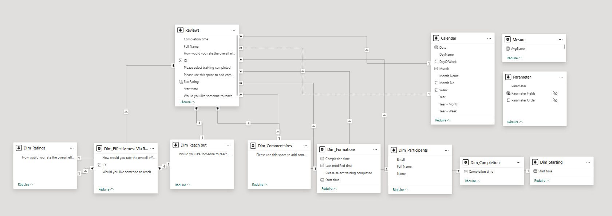
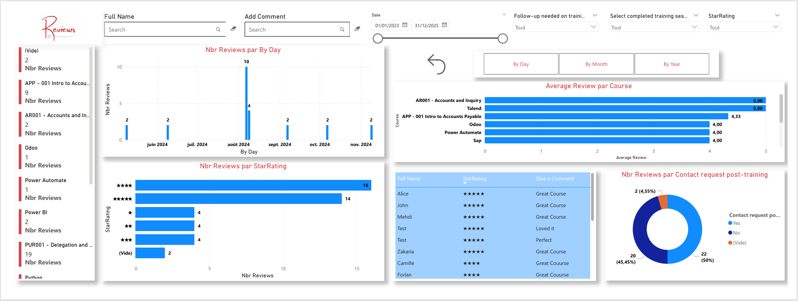
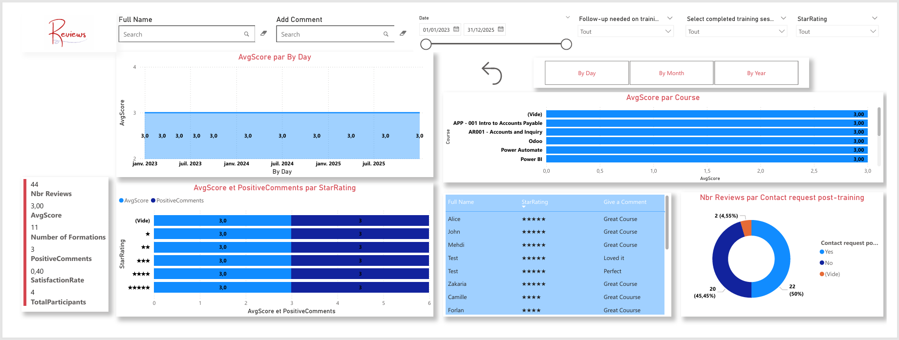
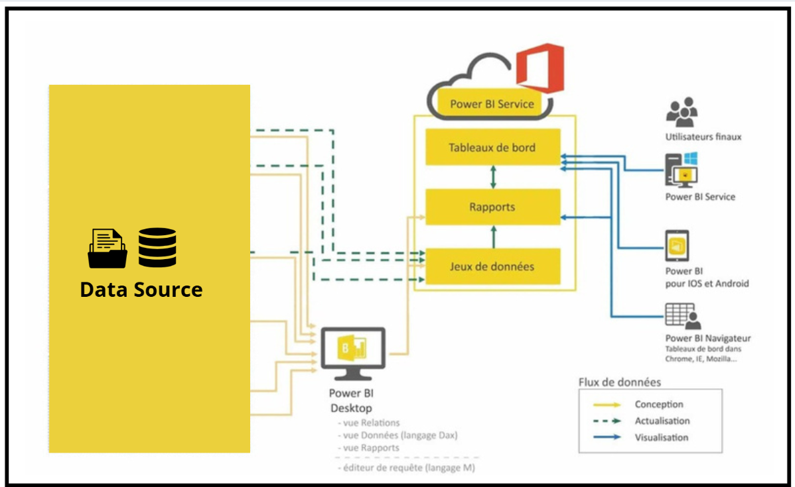

# ⭐ Reviews Dashboard with Power BI

## 📑 Table of Contents

- [Project Overview](#project-overview)
- [Data Sources](#data-sources)
- [Data Preparation and Modeling](#data-preparation-and-modeling)
  - [Power Query](#power-query)
  - [Data Model](#data-model)
  - [DAX Measures](#dax-measures)
- [Dashboards](#dashboards)
- [Key KPIs](#key-kpis)
- [Technical Architecture](#technical-architecture)
- [Results & Insights](#results--insights)
- [Limitations & Improvements](#limitations--improvements)
- [Author](#author)

---

## 🚀 Project Overview

This project focuses on analyzing training reviews using **Microsoft Power BI**.  
The goal is to provide interactive dashboards that help monitor:

- Participants’ satisfaction with trainings.  
- Ratings distribution (1 to 5 stars).  
- Comments and qualitative feedback.  
- Post-training follow-up requests.  
- Training completion and participation trends over time.  

---

## 📂 Data Sources

- **Reviews** → Core table containing participants’ evaluations.  
- **Dim_Formations** → Training details.  
- **Dim_Participants** → Participant information.  
- **Dim_Commentaires** → Qualitative comments.  
- **Dim_Ratings** → Training ratings.  
- **Dim_Effectiveness Via Reach** → Post-training effectiveness perception.  
- **Dim_Reach out** → Follow-up requests.  
- **Dim_Completion** → Completion details.  
- **Calendar** → Date dimension for time-based analysis.  

---

## 🔄 Data Preparation and Modeling

### 🔹 Power Query

- Data cleaning: removal of nulls, renaming fields, standardizing types.  
- Creation of a **Calendar table** to enable time intelligence.  
- Filtering invalid or duplicate reviews.  

### 🔹 Data Model

The model follows a **star schema** where the **Reviews table** is central and linked to multiple dimensions.  

📌 Data Model:  

    

### 🔹 DAX Measures

Examples of key measures:  

```DAX
-- Average Score
AvgScore = AVERAGE('Dim_Ratings'[How would you rate the overall effectiveness of today's training?])

-- Total Reviews
Nbr Reviews = COUNTROWS(Reviews)

-- Total Formations
Number of Formations = COUNTROWS('Dim_Formations')

-- Positive Comments
PositiveComments =
COUNTROWS(
    FILTER(
        'Dim_Commentaires',
        'Dim_Commentaires'[Please use this space to add comments about the effectiveness of today's training.] 
        IN {"Loved it", "Great Course", "Perfect"}
    )
)

-- Satisfaction Rate
SatisfactionRate =
DIVIDE(
    COUNTROWS(FILTER('Dim_Ratings','Dim_Ratings'[How would you rate the overall effectiveness of today's training?] >= 4)),
    COUNTROWS('Dim_Ratings')
)

-- Distinct Participants
TotalParticipants = DISTINCTCOUNT('Dim_Effectiveness Via Reach'[ID])
```  

---

## 📊 Dashboards

The dashboard provides both **quantitative KPIs** and **qualitative insights**.  

### 🔹 Reviews Overview  
- Average Review by Course.  
- Number of Reviews by Star Rating.  
- Distribution of reviews over time (By Day, Month, Year).  

### 🔹 Qualitative Feedback  
- Comments table (“Give a Comment”).  
- Analysis of positive vs negative feedback.  

### 🔹 Post-Training Follow-up  
- Number of participants requesting follow-up.  
- Correlation between low ratings and follow-up needs.  

📌 **Screenshot Example:**  

  
    

📌 **Project Files:**  
- [Power BI Project File (.pbix)](Views_Advanced.pbix)
- [Power BI Project File (.pdf)](Views_Advanced.pdf)  
- [Detailed Project Design Document (PDF)](reviewsDsd.pdf)  

---

## 📌 Key KPIs  

- **AvgScore** → Average rating per training.  
- **Nbr Reviews** → Total reviews submitted.  
- **PositiveComments** → Count of positive comments (e.g., “Loved it”, “Perfect”).  
- **Number of Formations** → Total trainings evaluated.  
- **SatisfactionRate** → % of ratings ≥ 4.  
- **TotalParticipants** → Unique participants who submitted reviews.  

---

## 🏗️ Technical Architecture  

The solution was built with **Power BI Desktop** and published on **Power BI Service**:  

1. Data connection to review datasets.  
2. Cleaning and transformation in Power Query.  
3. Star-schema modeling with measures in DAX.  
4. Dashboard design with interactive filters (course, participant, rating).  
5. Online sharing via Power BI Service.  



---

## 📈 Results & Insights  

- Trainings **AR001** and **Talend** achieved the highest satisfaction (average score of 5).  
- Some trainings scored lower, requiring corrective action.  
- Around **50% of participants requested follow-up**, showing potential post-training needs.  
- Review activity showed **peaks during certain months**, suggesting seasonal engagement trends.  
- Positive comments (“Great Course”, “Perfect”) highlight strong participant satisfaction, while written feedback helps pinpoint improvement areas.  

---

## ⚠️ Limitations & Improvements  

- Current dataset is static; implementing **real-time refresh** would improve monitoring.  
- Adding **sentiment analysis** on comments for deeper qualitative insights.  
- Integration with **HR systems** to cross-analyze with performance data.  
- Implement **Row-Level Security (RLS)** for controlled access in Power BI Service.  

---

## 👩‍💻 Author  

**Rania Alayachi**  
📧 alayachi.rania23@gmail.com  
🔗 [LinkedIn Profile](https://www.linkedin.com/in/rania-al-ayachi/)  
